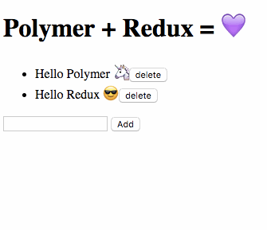

# Polymer and Redux 🦄

> Implementing Redux with Polymer.

[](https://travis-ci.org/afonsopacifer/polymer-redux)



## Run the project locally

**1 -** Prepare the environment:

```sh
$ npm install -g polymer-cli
```

**2 -** Clone the project and install the dependencies:

```sh
$ git clone https://github.com/afonsopacifer/polymer-redux.git
$ cd polymer-redux
$ npm install
$ bower install
```
**3 -** Run the server:

```sh
$ polymer serve
```

Go to: [localhost:8080](http://localhost:8080/)

## Tests

#### Linting

Linting with polylint:

```sh
$ [sudo] npm install -g polylint

$ polylint
```

## Versioning

To keep better organization of releases we follow the [Semantic Versioning 2.0.0](http://semver.org/) guidelines.

## Contributing
Find on our [issues](https://github.com/afonsopacifer/polymer-redux/issues/) the next steps of the project ;)
<br>
Want to contribute? [Follow these recommendations](https://github.com/afonsopacifer/polymer-redux/blob/master/CONTRIBUTING.md).

## History
See [Releases](https://github.com/afonsopacifer/polymer-redux/releases) for detailed changelog.

## License
[MIT License](https://github.com/afonsopacifer/polymer-redux/blob/master/LICENSE.md) © [Afonso Pacifer](http://afonsopacifer.github.io/)
